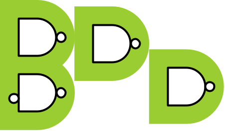

# Bathtub



Bathtub is a free open-source
SystemVerilog package
based on UVM 
that brings Agile Behavior-Driven Development (BDD)
and Gherkin
to the design and verification of integrated circuits,
enabling executable specifications and true living documentation.

## Behavior-Driven Development for Integrated Circuits
BDD helps you and your colleagues bring your diverse perspectives--business, design, verification, software--to the specification of new RTL features for your ASIC, SoC, FPGA, and IP projects. Together, you create living documentation that not only describes the intent, but also automatically checks the behavior of the device.
* Write your chip design specs in Cucumber-compliant Gherkin, the de facto standard plain text file format for executable specifications.
* Give concrete examples that illustrate functionality and guide front-end design.
* Bathtub reads and parses your Gherkin files and runs them as automated acceptance tests against your RTL.
* When the tests pass, you know your RTL behaves as the specs say it should.
* BDD is not just for software development anymore; IC design and verification can be Agile too!

```gherkin
# Sample Gherkin feature file

Feature: Arithmetic Logic Unit division operations

    The arithmetic logic unit performs integer division.

    Scenario: With integer division, the remainder is discarded
        Given operand A is 15 and operand B is 4
        When the ALU performs the division operation
        Then the result should be 3
        And the DIV_BY_ZERO flag should be clear

    Scenario: Attempting to divide by zero results in an error
        Given operand A is 10 and operand B is 0
        When the ALU performs the division operation
        Then the DIV_BY_ZERO flag should be raised
```

## Seamless Integration with Existing Verification Environments
As a design verification engineer, you use Bathtub to translate the natural language Gherkin files into self-checking SystemVerilog tests that exercise your DUT so you can close the BDD loop and drive to tapeout with confidence.
* Bathtub is written entirely in SystemVerilog and UVM open source code; there are no additional applications to install or integrate.
* Run Bathtub natively in your SystemVerilog simulator as an extension of your UVM tests, e.g., `+UVM_TESTNAME=my_bathtub_test`.
* Reuse all your current verification components, unchanged.
* With convenient Bathtub macros, write parameterized step definitions in the form of simple UVM virtual sequence classes for all the _Given-When-Then_ steps in your Gherkin scenarios.
* Include your Bathtub tests in your regression suites to validate changes to specs and RTL.
* You're not limited to RTL; you can use BDD to document, implement, and unit-test stand-alone verification components or, for that matter, _any_ isolated SystemVerilog code.

```sv
// Sample step definition: a UVM virtual sequence class

class set_operand_A_and_B_vseq extends alu_base_vsequence
        implements bathtub_pkg::step_definition_interface;

    `Given("operand A is %d and operand B is %d")

    int operand_A, operand_B;

   `uvm_object_utils(set_operand_A_and_B_vseq)
    function new (string name="set_operand_A_and_B_vseq");
        super.new(name);
    endfunction : new

    virtual task body();
        // Extract the parameters
        `step_parameter_get_args_begin()
        operand_A = `step_parameter_get_next_arg_as(int);
        operand_B = `step_parameter_get_next_arg_as(int);
        `step_parameter_get_args_end

        // Do the actual work using the API in the base sequence
        super.set_operand_A(operand_A); 
        super.set_operand_B(operand_B);
    endtask : body
endclass : set_operand_A_and_B_vseq
```

## Getting Started
Bathtub originated at Everactive, but it is now actively maintained as a personal project here: <https://github.com/williaml33moore/bathtub>.

That repository also hosts a Bathtub web site: <https://williaml33moore.github.io/bathtub/>.

These easy-to-remember bookmarkable URLs all redirect you to the home page:
* [bathtubBDD.dev](https://bathtubbdd.dev)
* [bathtubBDD.com](http://bathtubbdd.com)
* [bathtubBDD.org](http://bathtubbdd.org)

**B.A.T.H.T.U.B.**: \
**B**DD \
**A**utomated \
**T**ests \
**H**elping \
**T**eams \
**U**nderstand \
**B**ehavior


